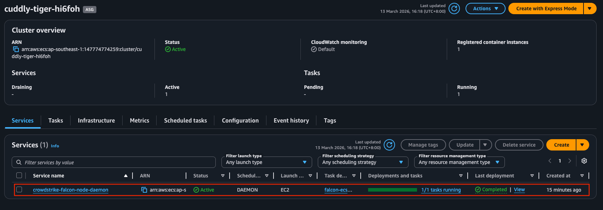
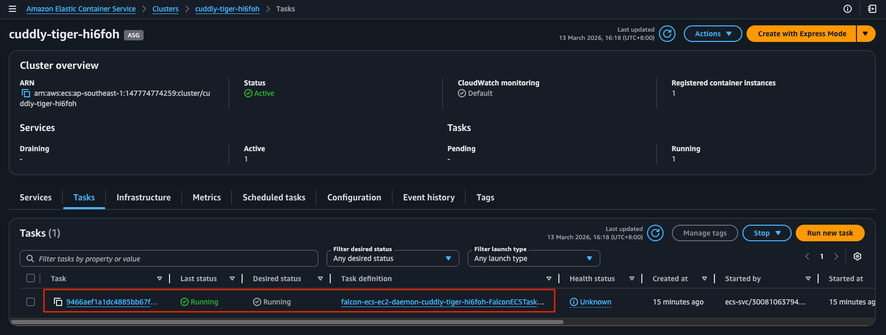
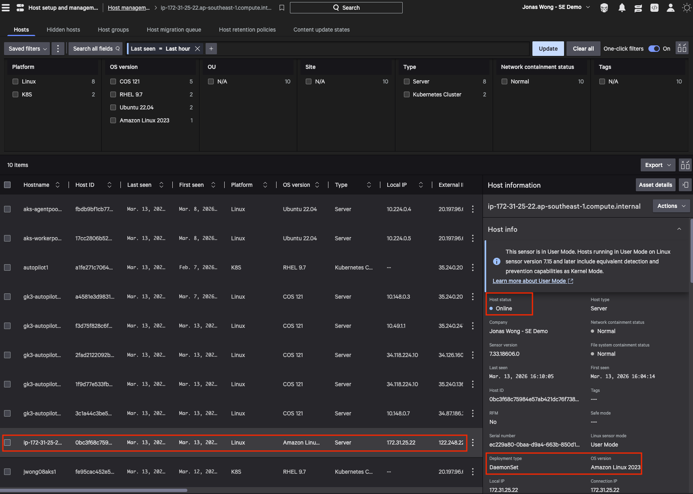

# Install Falcon Sensor as ECS Daemonset on ECS Clusters Backed by EC2

This follows the documentation [here](https://falcon.crowdstrike.com/documentation/page/m89e4d3d/deploy-falcon-sensor-for-linux-on-ecs-ec2-clusters-with-aws-cloudformation)

This is for self-managed EC2 instances for ECS capacity provider, not managed instances which is like EKS Auto. As of March 2026, ECS with Managed Instances is not supported.

All the commands below can be run from AWS CloudShell.

## Pre-requisites:
- Assume that the Falcon Sensor Image is already stored in AWS ECR
- Make sure AWS CLI region is same region as ECS Cluster
- Make sure you use ECS optimized AMI image in creating the self-managed capacity provider, this should be taken care of automatically for you if you create the auto-scaling group for the capacity provider via the web UI

## Step 1: Prepare Environment Variables

Here we assume Falcon sensor for Linux version is 7.33 and later:

```bash
export ECS_EC2_CLUSTER_NAME=<CLUSTER_NAME>
export FALCON_CID=<CUSTOMER_ID>
export FALCON_FULL_IMAGE_PATH=<AWS_ACCOUNT_ID>.dkr.ecr.<REGION>.amazonaws.com/<REGISTRY_NAME>/falcon-sensor:<VERSION>
```

## Step 2: Get the CloudFormation Template

```bash
git clone https://github.com/CrowdStrike/aws-cloudformation-falcon-sensor-ecs.git
```

## Step 3: Deploy with CloudFormation

Edit and save parameters file **falcon-ecs-ec2-daemon-parameters.json**:

```json
[
  "ECSClusterName=<CLUSTER_NAME>",
  "FalconCID=<CUSTOMER_ID>",
  "FalconImagePath=<AWS_ACCOUNT_ID>.dkr.ecr.<REGION>.amazonaws.com/<REGISTRY_NAME>/falcon-sensor:<VERSION>"
]
```

Go into the directory with the CloudFormation files and deploy the CloudFormation stack:

```bash
aws cloudformation deploy \
  --stack-name falcon-ecs-ec2-daemon-$ECS_EC2_CLUSTER_NAME \
  --template-file falcon-ecs-ec2-daemon.yaml \
  --parameter-overrides file://falcon-ecs-ec2-daemon-parameters.json
```

## Results

### Falcon Sensor Daemonset Service in ECS Cluster


### Falcon Sensor Daemonset Task in ECS Cluster


### Sensor Registration in Falcon Platform
