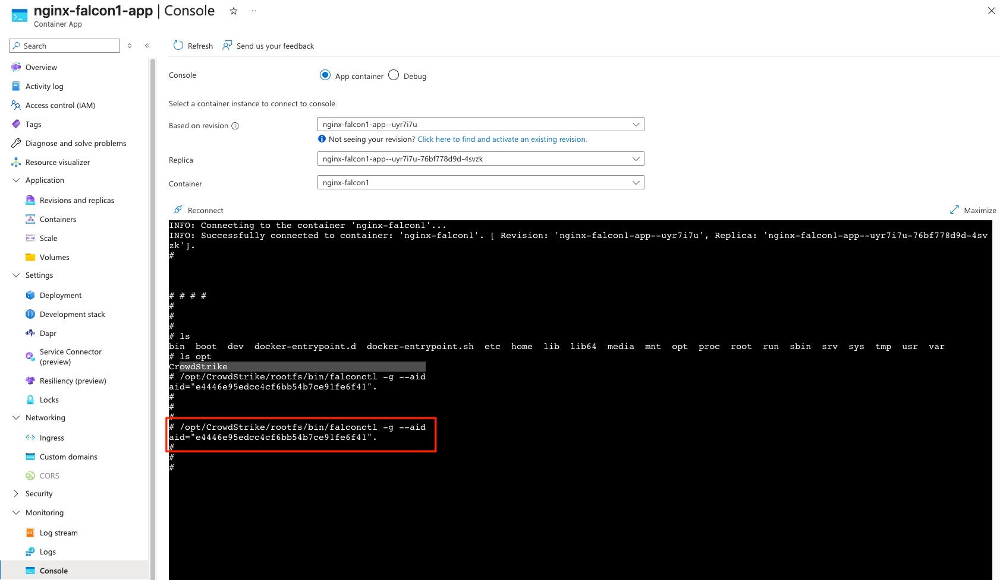
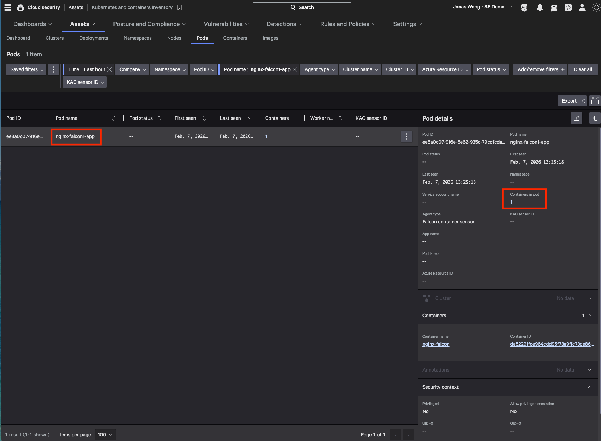
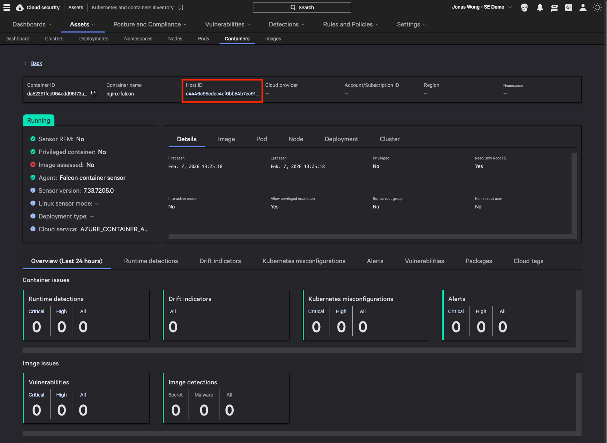

# Installing Falcon Sensor for Azure Container Apps

Article follows instructions at https://docs.crowdstrike.com/r/td7c91f4

## Pre-requisites

- Azure Container Registry or some image registry to contain the Falcon Container Sensor for Linux Image and the application image
- If using Azure Container Registry, sufficient permissions of acrPull and acrPush on a security principal
- Docker CLI and Docker daemon running on the machine where the image patching is done
- You know your CID and the full path to the falcon container sensor image

## Run the Falcon Patching Utility from the Falcon Container

### Step 1

Try to run this from a linux jump host that has Azure CLI, Docker client, Docker daemon installed and is not behind a proxy

```bash
az login -t <TENANT_ID> --use-device-code
az acr login --name <REGISTRY_NAME>
```

### Step 2 Option 1 - Run the Falcon utility within the Falcon Container

```bash
docker run --user 0:0 \
-v ${HOME}/.docker/config.json:/root/.docker/config.json \
-v /var/run/docker.sock:/var/run/docker.sock \
falconutil patch-image aca \
--source-image-uri docker.io/library/nginx:latest \
--target-image-uri <CONTAINER_REGISTRY>/nginx-falcon \
--falcon-image-uri <CONTAINER_REGISTRY>/falcon-container:7.33.0-7205 \
--cid <CUSTOMER_ID> \
--container nginx-falcon \
--resource-group <RESOURCE_GROUP> \
--subscription <SUBSCRIPTION_ID> \
--cloud-service ACA
```


### Step 2 Option 2 - Run the Falcon utility on the host as a standalone binary

You basically run the Falcon container sensor locally on a linux host, then copy out **falconutil** to the local drive before deleting the container

Copy out falconutil from the running container:

```bash
id=$(docker create <CONTAINER_REGISTRY>/falcon-container:7.33.0-7205)
docker cp $id:/usr/bin/falconutil /tmp
docker rm -v $id
```

Use falconutil to patch:

```bash
/tmp/falconutil patch-image \
--source-image-uri docker.io/library/nginx:latest \
--target-image-uri <CONTAINER_REGISTRY>/nginx-falcon:1.0 \
--falcon-image-uri <CONTAINER_REGISTRY>/falcon-container:7.33.0-7205 \
--cid <CUSTOMER_ID> \
--container nginx-falcon \
--resource-group <RESOURCE_GROUP> \
--subscription <SUBSCRIPTION_ID> \
--cloud-service ACA
```

The output should look like the below:

```
⇒ [internal] load remote build context
⇒ [internal] load remote build context
⇒ copy /context /
⇒ [internal] load metadata for <CONTAINER_REGISTRY>/falcon-container:7.33.0-7205
⇒ [internal] load metadata for docker.io/library/nginx:latest
⇒ resolve <CONTAINER_REGISTRY>/falcon-container:7.33.0-7205@sha256:1aec2d34a0a7230591811250ea00952a4b884a7916043f93ae26ee9370f14c54
⇒ [build 1/7] FROM <CONTAINER_REGISTRY>/falcon-container:7.33.0-7205@sha256:1aec2d34a0a7230591811250ea00952a4b884a7916043f93ae26ee9370f14c54
⇒ [build 1/7] FROM <CONTAINER_REGISTRY>/falcon-container:7.33.0-7205@sha256:1aec2d34a0a7230591811250ea00952a4b884a7916043f93ae26ee9370f14c54
⇒ [build 1/7] FROM <CONTAINER_REGISTRY>/falcon-container:7.33.0-7205@sha256:1aec2d34a0a7230591811250ea00952a4b884a7916043f93ae26ee9370f14c54
⇒ [stage-1 1/2] FROM docker.io/library/nginx:latest@sha256:341bf0f3ce6c5277d6002cf6e1fb0319fa4252add24ab6a0e262e0056d313208
⇒ resolve docker.io/library/nginx:latest@sha256:341bf0f3ce6c5277d6002cf6e1fb0319fa4252add24ab6a0e262e0056d313208
⇒ [stage-1 1/2] FROM docker.io/library/nginx:latest@sha256:341bf0f3ce6c5277d6002cf6e1fb0319fa4252add24ab6a0e262e0056d313208
⇒ [build 2/7] RUN mkdir -p /tmp/CrowdStrike/rootfs/usr/bin && cp -R /usr/bin/falcon* /usr/bin/injector /tmp/CrowdStrike/rootfs/usr/bin
⇒ [stage-1 1/2] FROM docker.io/library/nginx:latest@sha256:341bf0f3ce6c5277d6002cf6e1fb0319fa4252add24ab6a0e262e0056d313208
⇒ [build 3/7] RUN cp -R /usr/lib64 /tmp/CrowdStrike/rootfs/usr/
⇒ [build 4/7] RUN mkdir -p /tmp/CrowdStrike/rootfs/usr/lib && cp -R /usr/lib/locale  /tmp/CrowdStrike/rootfs/usr/lib
⇒ [build 5/7] RUN cd /tmp/CrowdStrike/rootfs && ln -s usr/bin bin && ln -s usr/lib64 lib64 && ln -s usr/lib lib
⇒ [build 6/7] RUN mkdir -p /tmp/CrowdStrike/rootfs/etc/ssl/certs && cp /etc/ssl/certs/ca-bundle* /tmp/CrowdStrike/rootfs/etc/ssl/certs
⇒ [build 7/7] RUN chmod -R a=rX /tmp/CrowdStrike
⇒ [stage-1 2/2] COPY --from=build /tmp/CrowdStrike /opt/CrowdStrike
⇒ exporting layers
⇒ exporting manifest sha256:b5ee556048a5b7ac613742a379a4c5757f4a2daf7daa8749f9d5e7a0f7299edc
⇒ exporting config sha256:6987b4aa266b01425e449fc5c73baf2958cd228fc54e3de14848506ea6801b2c
⇒ naming to <CONTAINER_REGISTRY>/nginx-falcon:1.0
⇒ unpacking to <CONTAINER_REGISTRY>/nginx-falcon:1.0
⇒ exporting to image
⇒ Successfully built image ID: sha256:b5ee556048a5b7ac613742a379a4c5757f4a2daf7daa8749f9d5e7a0f7299edc
```

### Step 3 - Push the image from local to remote repository

```bash
docker push <CONTAINER_REGISTRY>/nginx-falcon:1.0
```

The output should look something like this:

```
The push refers to repository [<CONTAINER_REGISTRY>/nginx-falcon]
46bf3a120c8e: Pushed
4f4efe02d542: Pushed
7b6cb8ccac7b: Pushed
f73400a233fd: Pushed
47cd406a84ef: Pushed
bae5a1799a80: Pushed
0c8d55a45c0d: Pushed
13203c147af5: Pushed
1.0: digest: sha256:b5ee556048a5b7ac613742a379a4c5757f4a2daf7daa8749f9d5e7a0f7299edc size: 1875
```

### Step 4 - Create the container app

Here you can just follow the instructions at the documentation https://docs.crowdstrike.com/r/cc23d849 to deploy the container app using the image you have created

**Note:**
- One of the steps may require Admin access on Azure Container registry to be temporarily enabled when pushing the patched image to it
- The role assignment steps using az cli seem a bit wrong, you can use the portal instead

### Step 5 - Verification

Check for agent ID or AID in the container, see the example below:


Check that the pod appears in FCS Pod inventory:


The host ID is actually the agent ID or AID:
