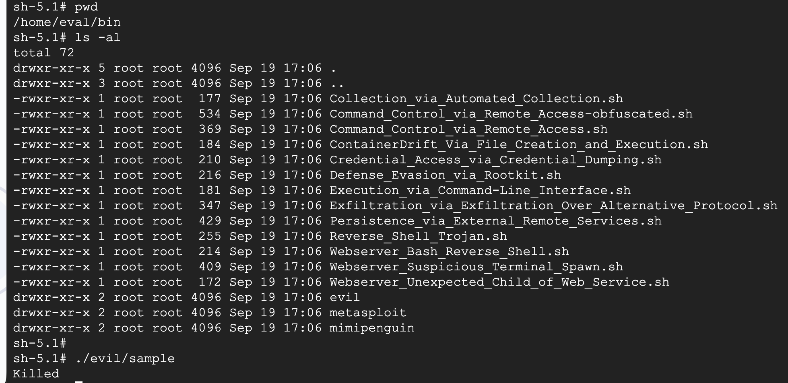
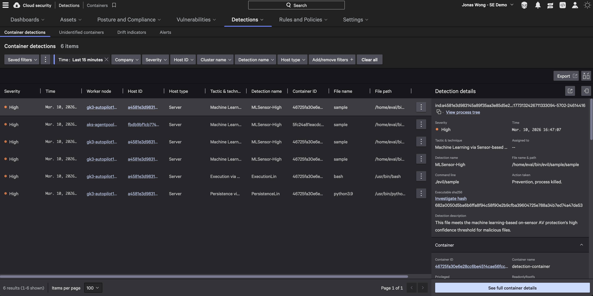

# Demonstrating Real-time Container Detections

## Prerequisites

- You should have the detections container running in your environment

## Step 1: Access the Detections Container

Execute into the detections container:

```bash
kubectl exec -it <detection-container-name> -- /bin/sh
```

## Step 2: Navigate and Run Detection Sample

Go to the appropriate directory in the container and run the detection sample:

```bash
sh-5.1# pwd
/home/eval/bin
sh-5.1# ls -al
total 72
drwxr-xr-x 5 root root 4096 Sep 19 17:06 .
drwxr-xr-x 3 root root 4096 Sep 19 17:06 ..
-rwxr-xr-x 1 root root  177 Sep 19 17:06 Collection_via_Automated_Collection.sh
-rwxr-xr-x 1 root root  534 Sep 19 17:06 Command_Control_via_Remote_Access-obfuscated.sh
-rwxr-xr-x 1 root root  369 Sep 19 17:06 Command_Control_via_Remote_Access.sh
-rwxr-xr-x 1 root root  184 Sep 19 17:06 ContainerDrift_Via_File_Creation_and_Execution.sh
-rwxr-xr-x 1 root root  210 Sep 19 17:06 Credential_Access_via_Credential_Dumping.sh
-rwxr-xr-x 1 root root  216 Sep 19 17:06 Defense_Evasion_via_Rootkit.sh
-rwxr-xr-x 1 root root  181 Sep 19 17:06 Execution_via_Command-Line_Interface.sh
-rwxr-xr-x 1 root root  347 Sep 19 17:06 Exfiltration_via_Exfiltration_Over_Alternative_Protocol.sh
-rwxr-xr-x 1 root root  429 Sep 19 17:06 Persistence_via_External_Remote_Services.sh
-rwxr-xr-x 1 root root  255 Sep 19 17:06 Reverse_Shell_Trojan.sh
-rwxr-xr-x 1 root root  214 Sep 19 17:06 Webserver_Bash_Reverse_Shell.sh
-rwxr-xr-x 1 root root  409 Sep 19 17:06 Webserver_Suspicious_Terminal_Spawn.sh
-rwxr-xr-x 1 root root  172 Sep 19 17:06 Webserver_Unexpected_Child_of_Web_Service.sh
drwxr-xr-x 2 root root 4096 Sep 19 17:06 evil
drwxr-xr-x 2 root root 4096 Sep 19 17:06 metasploit
drwxr-xr-x 2 root root 4096 Sep 19 17:06 mimipenguin
sh-5.1#
sh-5.1# ./evil/sample
Killed
```

You should see a **Killed** message, indicating that the Falcon sensor detected and terminated the malicious process.



## Step 3: Verify Detection in Falcon Portal

Check the Falcon console to confirm the detection was logged:

