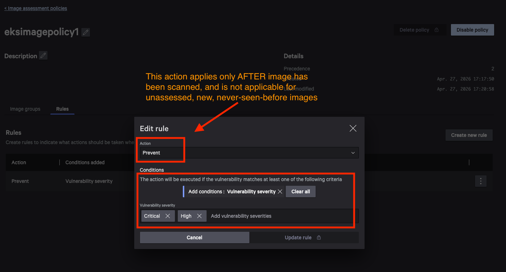
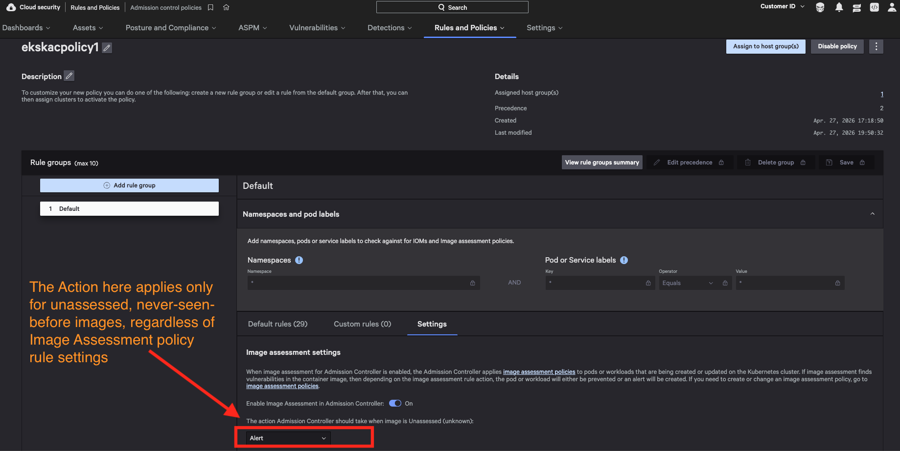
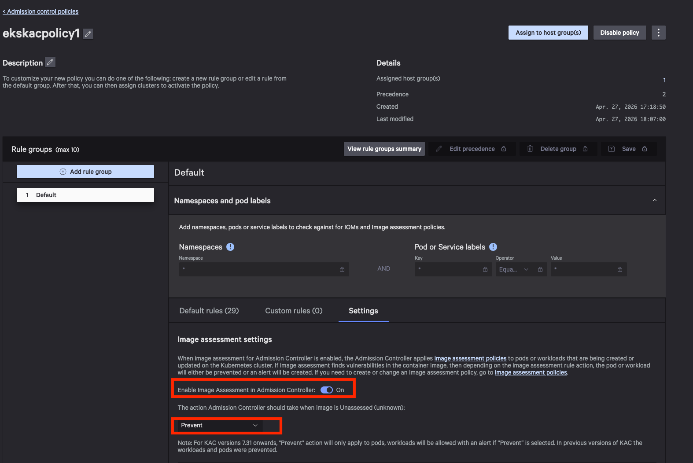
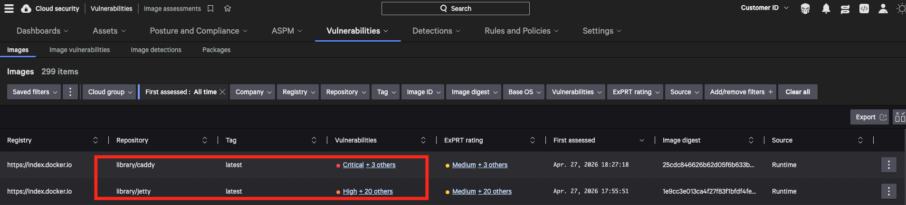

# Image Assessment and Admission Control (IAR) Notes

## Overview

This document explains the behavior of CrowdStrike Falcon's Image Assessment and Admission Control features, particularly how different policy settings affect container deployment based on image scan status.

## Key Concepts

### Image States
- **Unassessed/Unaccessed Images:** New images that have never been scanned by Falcon
- **Assessed Images:** Images that have been scanned and have assessment results available

### Policy Types
- **Image Assessment Policy:** Controls actions for assessed images with known vulnerabilities
- **Admission Controller Action for Unaccessed Images:** Controls actions for unassessed images

## Configuration Overview

### Image Assessment Policy

The Image Assessment policy determines what happens when vulnerabilities are found in **scanned images**:



### KAC Image Settings

The Kubernetes Admission Controller (KAC) settings for image handling:



### Admission Controller Actions

The behavior for **unscanned images** depends on how you configure the Admission Controller's action for unaccessed images:



#### Prevent Mode (Unaccessed Images)
- **Action:** Blocks deployment
- **Result:** The image will **NOT** get deployed
- **Use Case:** Strict security environments where only pre-scanned images are allowed

#### Alert Mode (Unaccessed Images)
- **Action:** Allows deployment with warnings
- **Result:** The image will still be allowed to run
- **Note:** This behavior only applies to unassessed images

> ⚠️ **Critical Understanding:** The Admission Controller "Unaccessed image settings" **ONLY** applies when the image is new and has never been assessed before. If an image has been assessed, then the rules in the **Image Assessment policy** will apply instead.

## Policy Precedence and Behavior

### Decision Flow

```
Image Deployment Request
         ↓
    Is image assessed?
         ↓
    ┌─────────────────┐
    │ YES: Assessed   │ ──→ Image Assessment Policy applies
    │ NO: Unassessed  │ ──→ Admission Controller Unaccessed settings apply
    └─────────────────┘
```

### Configuration Matrix

| Image Status | Policy Applied | Configuration Setting |
|--------------|----------------|----------------------|
| **Unassessed** | Admission Controller Action | Prevent/Alert for unaccessed images |
| **Assessed** | Image Assessment Policy | Prevent/Alert based on vulnerability findings |

## Image Assessment Results

The following shows the actual scan results for the container images used in our examples. These assessment results directly influence the policy decisions and behaviors demonstrated in the examples below:



### Assessment Summary

Based on the scan results shown above:

- **Caddy Image:**
  - Status: Initially unassessed (shows "Image Assessment result is unavailable")
  - Behavior: Controlled by Admission Controller settings for unaccessed images

- **Jetty Image:**
  - Status: Initially unassessed, later assessed with vulnerability findings
  - Behavior:
    - **First deployment:** Controlled by Admission Controller settings (unassessed)
    - **Subsequent deployments:** Controlled by Image Assessment policy (assessed with vulnerabilities)

> 📊 **Assessment Impact:** The scan results demonstrate why jetty deployments are eventually blocked - once assessed, the Image Assessment policy identifies security vulnerabilities that trigger the prevention mechanism when the policy is set to "Prevent."

## Examples: Understanding the Behavior

### Example 1: Unassessed Image with Prevent Mode

When deploying a **new, unscanned** image with Admission Controller in **Prevent mode**:

```bash
kubectl create deployment caddy-deployment --image=caddy --replicas=2 --namespace=project1
```

**Output:**
```
Warning: 10 warnings from admission webhook "validating.falcon-kac.crowdstrike.com":
- container(s) may possess Linux CAP_NET_RAW capability: {"container: caddy"}
- container(s) may possess Linux CAP_SYS_ADMIN capability: {"container: caddy"}
- container(s) missing securityContext.runAsNonRoot: {"container: caddy"}
- container(s) not setting cpu/memory limits: {"container: caddy"}
- container(s) running with either unconfined apparmor policy or no SELinux configuration: {"container: caddy"}
- container(s) running with many capabilities: {"container: caddy"}
- container(s) running without seccompProfile.type=RuntimeDefault: {"container: caddy"}
- container(s) without securityContext: {"container: caddy"}
- workload resource mounts service account token
- Image Assessment result is unavailable for image "caddy" in container "caddy"

deployment.apps/caddy-deployment created
```

**Result:**
```bash
kubectl get deploy -n project1
```
```
NAME               READY   UP-TO-DATE   AVAILABLE   AGE
caddy-deployment   0/2     0            0           10m
```

> ⚠️ **Key Observation:** Deployment created but **no pods running** (0/2 READY). Prevent mode blocks unassessed images.

### Example 2: Unassessed Image with Alert Mode

When deploying a **new, unscanned** image with Admission Controller in **Alert mode**:

```bash
kubectl create deployment jetty-deployment --image=jetty --replicas=2 --namespace=project1
```

**Output:**
```
Warning: 9 warnings from admission webhook "validating.falcon-kac.crowdstrike.com":
- container(s) may possess Linux CAP_NET_RAW capability: {"container: jetty"}
- container(s) may possess Linux CAP_SYS_ADMIN capability: {"container: jetty"}
- container(s) missing securityContext.runAsNonRoot: {"container: jetty"}
- container(s) not setting cpu/memory limits: {"container: jetty"}
- container(s) running with either unconfined apparmor policy or no SELinux configuration: {"container: jetty"}
- container(s) running with many capabilities: {"container: jetty"}
- container(s) running without seccompProfile.type=RuntimeDefault: {"container: jetty"}
- container(s) without securityContext: {"container: jetty"}
- workload resource mounts service account token

deployment.apps/jetty-deployment created
```

**Result:**
```bash
kubectl get deploy -n project1
```
```
NAME               READY   UP-TO-DATE   AVAILABLE   AGE
caddy-deployment   0/2     0            0           11m
crwd-httpd         2/2     2            2           142m
httpd-deployment   2/2     2            2           149m
jetty-deployment   2/2     2            2           45m
```

> ✅ **Key Observation:** The jetty deployment is **fully operational** (2/2 READY) because Alert mode allows unassessed images.

### Example 3: Assessed Image with Vulnerabilities

After the jetty image has been **assessed and found to have vulnerabilities**, even with Alert mode for unaccessed images, the **Image Assessment policy** now takes precedence:

```bash
kubectl create deploy jetty-new-deployment --image=jetty --namespace=project1 --replicas=2
```

**Output:**
```
Warning: 9 warnings from admission webhook "validating.falcon-kac.crowdstrike.com":
- container(s) may possess Linux CAP_NET_RAW capability: {"container: jetty"}
- container(s) may possess Linux CAP_SYS_ADMIN capability: {"container: jetty"}
- container(s) missing securityContext.runAsNonRoot: {"container: jetty"}
- container(s) not setting cpu/memory limits: {"container: jetty"}
- container(s) running with either unconfined apparmor policy or no SELinux configuration: {"container: jetty"}
- container(s) running with many capabilities: {"container: jetty"}
- container(s) running without seccompProfile.type=RuntimeDefault: {"container: jetty"}
- container(s) without securityContext: {"container: jetty"}
- workload resource mounts service account token

error: failed to create deployment: admission webhook "workload.validating.falcon-kac.crowdstrike.com" denied the request:
deployments.apps "jetty-new-deployment" is forbidden: Image Assessment reported vulnerabilities for image "jetty" in container "jetty"
```

> 🔒 **Critical Observation:** The deployment is now **completely blocked** because:
> 1. The jetty image has been assessed and vulnerabilities were found
> 2. The Image Assessment policy is set to "Prevent"
> 3. Image Assessment policy overrides the Admission Controller unaccessed settings

## Behavior Summary

### Policy Precedence Table

| Scenario | Image Status | Policy Applied | Alert Mode Result | Prevent Mode Result |
|----------|--------------|----------------|-------------------|-------------------|
| **First Deployment** | Unassessed | Admission Controller | ✅ Allows | ❌ Blocks |
| **After Assessment** | Assessed (with vulnerabilities) | Image Assessment | ❌ Blocks* | ❌ Blocks* |
| **After Assessment** | Assessed (clean) | Image Assessment | ✅ Allows | ✅ Allows |

*Assuming Image Assessment policy is set to "Prevent" for vulnerability findings

### Mode Comparison Summary

| Configuration | Deployment Object | Pod Creation | Security Warnings | Use Case |
|---------------|-------------------|--------------|-------------------|----------|
| **Prevent (Unaccessed)** | ✅ Created | ❌ Blocked | ⚠️ Shown | High-security environments |
| **Alert (Unaccessed)** | ✅ Created | ✅ Allowed | ⚠️ Shown | Balanced security with flexibility |
| **Assessed with Vulnerabilities** | ❌ Blocked | ❌ Blocked | ⚠️ Shown | Follows Image Assessment policy |

## Security Warnings Explained

The admission webhook generates multiple security warnings for containers that don't follow security best practices:

| Warning Type | Description | Security Impact |
|--------------|-------------|-----------------|
| **CAP_NET_RAW** | Container may have network raw socket capabilities | Could allow network sniffing |
| **CAP_SYS_ADMIN** | Container may have system administration capabilities | Broad system access |
| **runAsNonRoot** | Container not explicitly configured to run as non-root | Potential privilege escalation |
| **Resource Limits** | CPU/memory limits not set | Resource exhaustion attacks |
| **Security Policies** | Missing AppArmor/SELinux configuration | Reduced container isolation |
| **Capabilities** | Running with excessive Linux capabilities | Expanded attack surface |
| **Seccomp Profile** | Missing seccomp security profile | System call filtering disabled |
| **Security Context** | No security context defined | Default security settings applied |
| **Service Account** | Mounts service account token | Potential credential exposure |
| **Image Assessment** | Image not scanned by Falcon | Unknown vulnerabilities |

## Best Practices

1. **Pre-scan Images:** Ensure all container images are scanned before deployment
2. **Security Context:** Always define proper security contexts for containers
3. **Resource Limits:** Set appropriate CPU and memory limits
4. **Capabilities:** Drop unnecessary Linux capabilities
5. **Non-root Execution:** Configure containers to run as non-root users
6. **Security Profiles:** Enable AppArmor/SELinux and seccomp profiles

## Key Takeaways

- **Unaccessed Image Settings:** Only apply to images that have never been scanned
- **Policy Precedence:** Image Assessment policy takes precedence over Admission Controller settings for assessed images
- **Vulnerability Impact:** Once an image is assessed and vulnerabilities are found, the Image Assessment policy determines the action
- **Security Configuration:** Both policies work together to provide layered security for container deployments